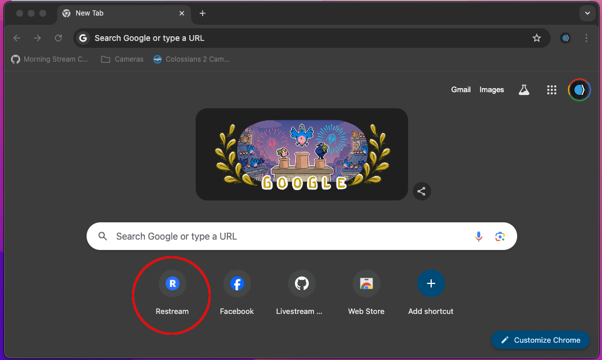
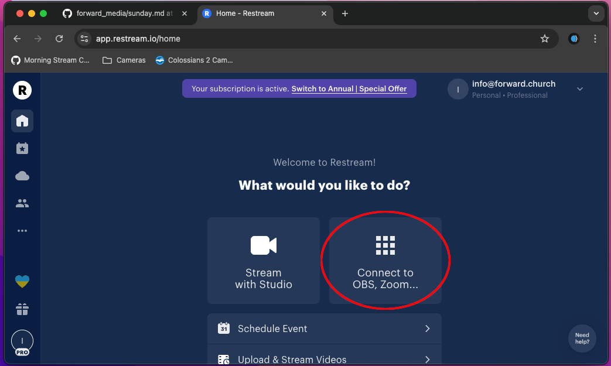
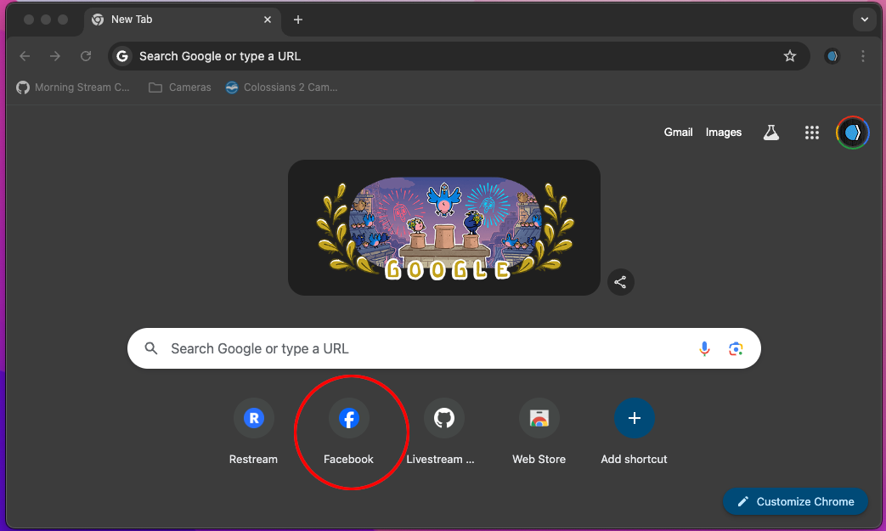
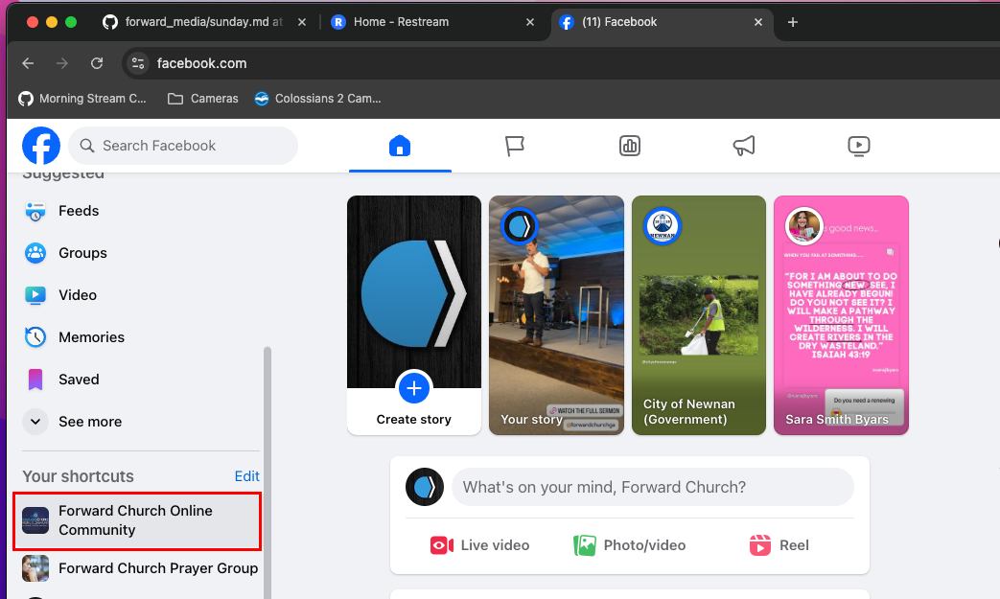
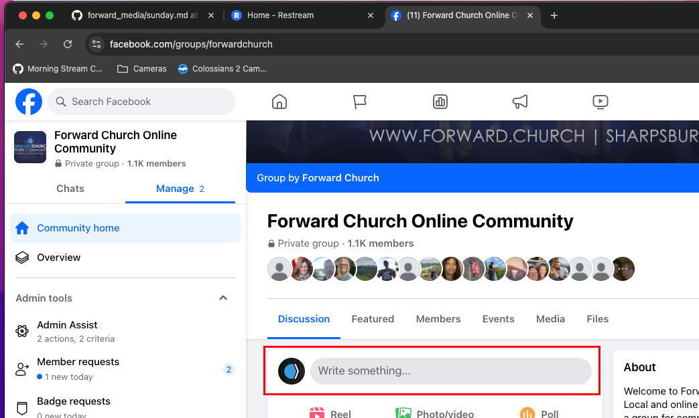
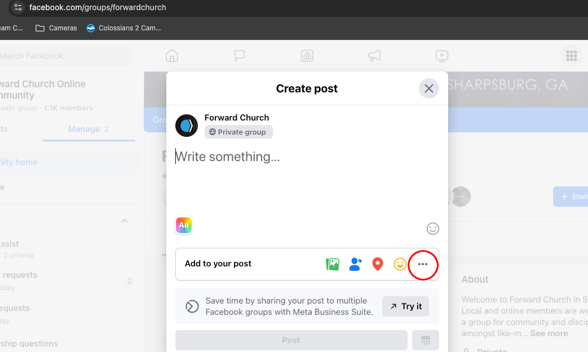
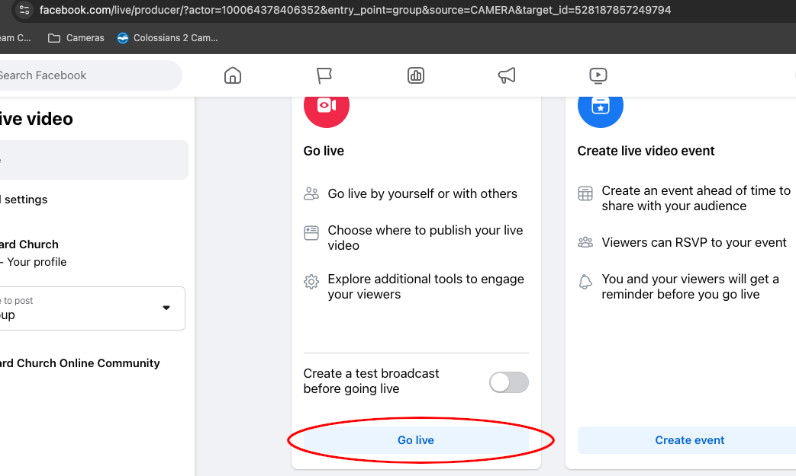
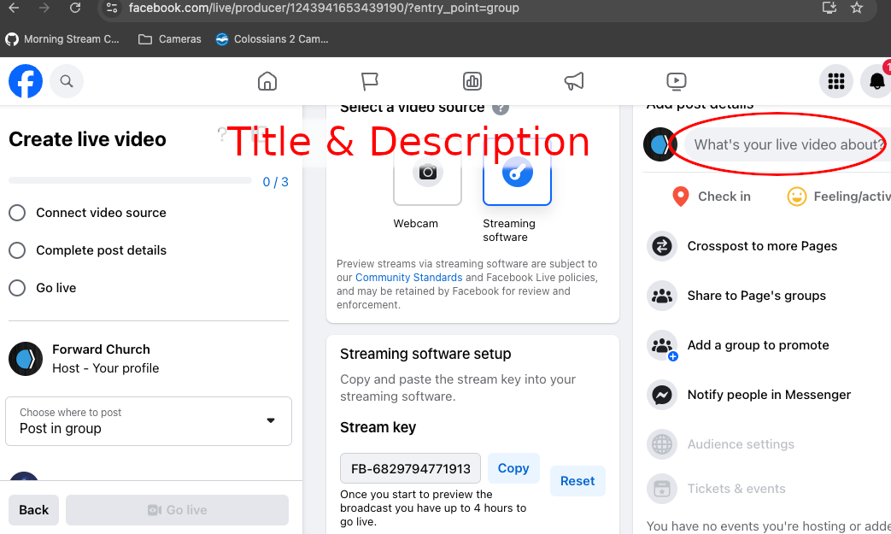
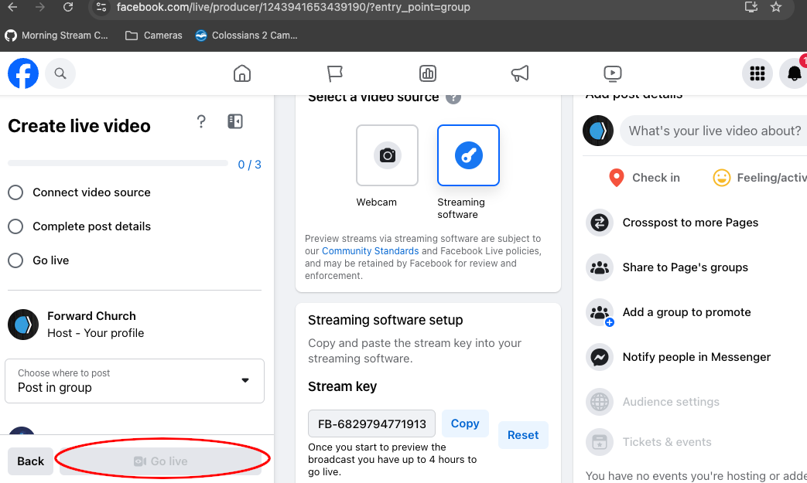
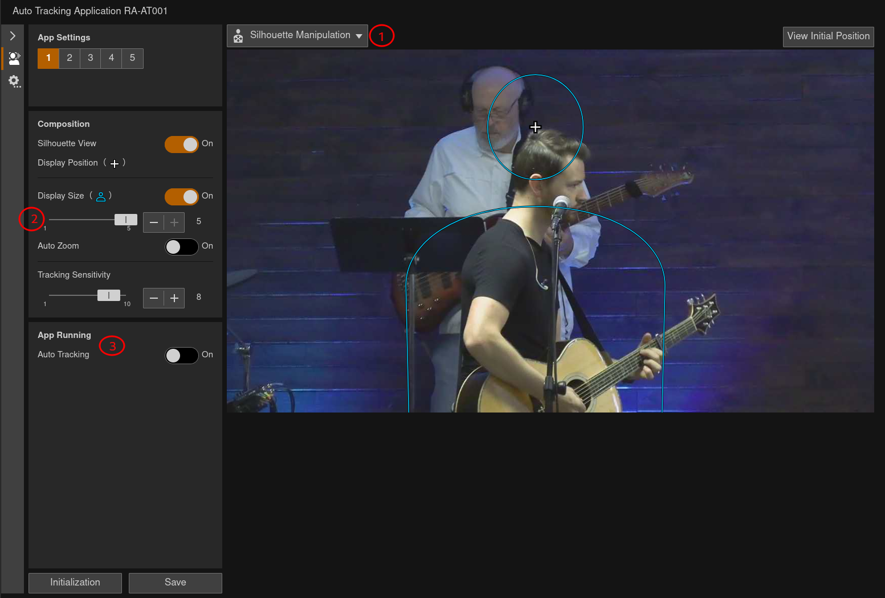

# Sunday Morning Checklist

Welcome to the Live Stream checklist. This is a living document and will change
as we improve services. Please note that the prioty of the stream is to keep
recording.  If we lose the internet connection, or experience network issues,
never stop OBS from recording. We can use the recording to upload a full
service during the week.

## Pre-Practice

### Hardware Setup

- [ ] Reboot Computer
- [ ] Turn on powerstrip with lights
- [ ] Turn on the PTZ controller
  - [ ] Once booted, goto settings -> ???? -> All Cameras -> On -> Enter to
        turn the Canon Cameras on.

### Software Setup

- [ ] Log into streaming computer
- [ ] Start OBS
  - [ ] Start streaming
- [ ] Open Chrome to get this checklist, start restream, setup Facebook, and
      get tracking online.

#### Launch Reastream.io

- [ ] Launch Restream.io website

    

- [ ] Choose the OBS option if it comes up

    

    Make sure all of the streaming service toggles are turned off.

- [ ] Update title and discription in restream.io [^1]

#### Facebook Private Group

- [ ] Launch Facebook

    

  - [ ] Setup Forward Church Online Community Stream, but do not go live yet
    - On the left side of the Facebook page is a shortcuts section. Select
      *Forward Church Online Community*.

        

    - Click the *Write something* dialogue in the center like you are going
      to write a new post.

        

    - Click the 3 `...` option on the new post, and select *Live Video*.

        

    - The left option, red icon, is go live. Click the *Go Live* button on
      the bottom of this column. It will not start the stream, but will get
      you to the screen to setup the livestream.

        

    - Set the same title and description you set in restream. Please note that
      FB does not show the title to viewers, and it should be included in the
      discription/body as well.

        

    - Go live to the Facebook Group in Restream and make sure it is recieving
      on the Facebook Community Group.
    - Wait till 9:55 to go live on the Facebook Group Page after starting the
      preservice video.

        

#### Tracking

- Open a new tab and select the *Center Cam - Tracking* bookmark from the
  cameras folder in the bookmark bar.
  - Tracking is a priority during the message portion to ensure editing later
    in the week gets the best shots for all streaming/media services.

      

      1. (1) Drop down for target selection and silhouette manipulation
      1. (2) Silhouette size option
      1. (3) Tracking on and off toggle

      Make sure the center camera is not the live camera before turning on
      the tracking software. When turned on, it will move the camera around.
      This is normal and you will need to readjust it with the controller.
      Once locked on you can switch back to the center camera.

      Make sure to set another camera as an emergency go-to. The tracking can
      lose the target if the face disappears from view. This can happen if
      they turn away from the camera or move too rapidly.

During practice is a good time to make some notes on parts of worship that
might be good for getting certain shots. I find using the slide numbers
on pro-presenter and writing shot ideas down can make it easier during worship
live.

[^1]: There should be an email in Apple Mail with the week's title and
    description. If it is not there, please find Clint or whoever is preaching
that week.

## Pre-Service

- [ ] Between practice and pre-service is a good time to add any special videos
  or media to the OBS scenes if applicable

Starting 5 minutes before 10am, we start pre-service.

- [ ] Start recording in OBS (this is a good time to also remind and assist the
  sound engineer to start recording)
- [ ] Make the pre-service video live in OBS
- [ ] Start stream in Forward Church **Private group** only

## Service

- [ ] As worship is winding up (use your judgment) make sure all streams go
      live. (YouTube **Page** and Facebook **Public** are priority)
- [ ] Setup tracking after announcements as the speaker get ready to start the
      message.

Be awesome and do a great job!

## Post Service

- [ ] Start the post service video in OBS as the service closes.  This needs to
  be done ASAP so we do not broadcast copywrited music.
- [ ] Stop recording on the video cameras
- [ ] While the end service video plays, go to both mixers and remove the flash
  drives (make sure the sound person stopped recording).
  - [ ] Attach the USBs to the streaming PC, and copy the audio recording from
    it to `LIVESTREAM` folder.
- [ ] When the post service video is over, stop streams
  - [ ] Stop Facebook Private group stream
  - [ ] Stop Restream.io
  - [ ] Stop streaming in OBS
- [ ] Stop OBS recording
- [ ] Power off Canon Cameras through the controller
- [ ] Power off PTZ controller
