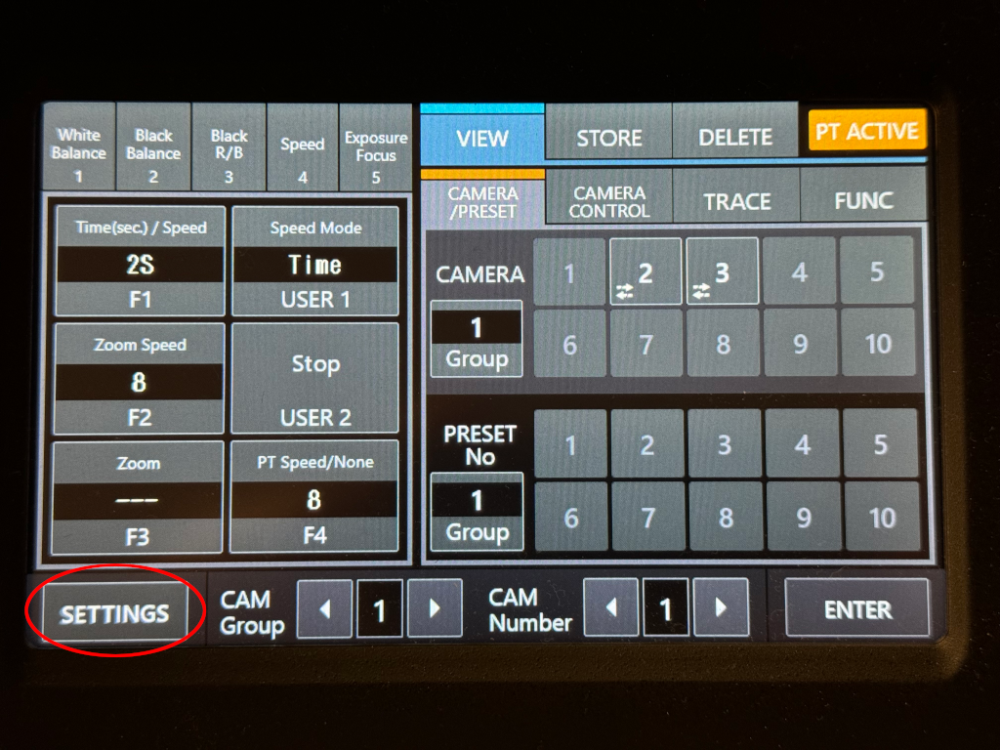
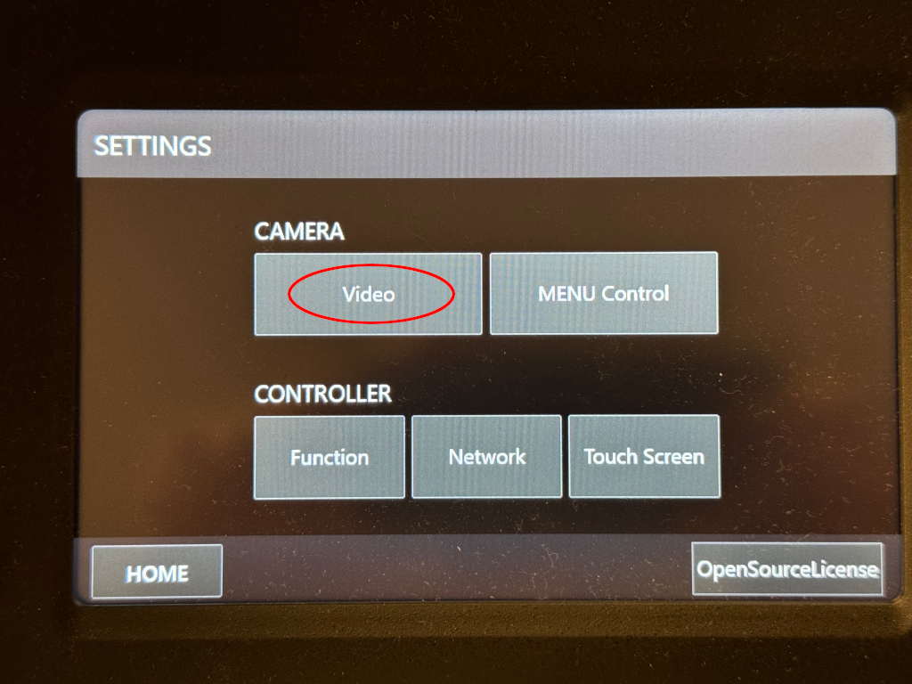
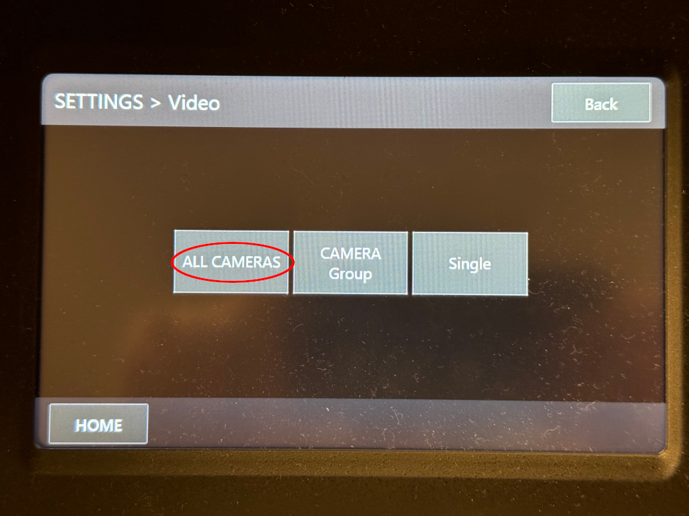
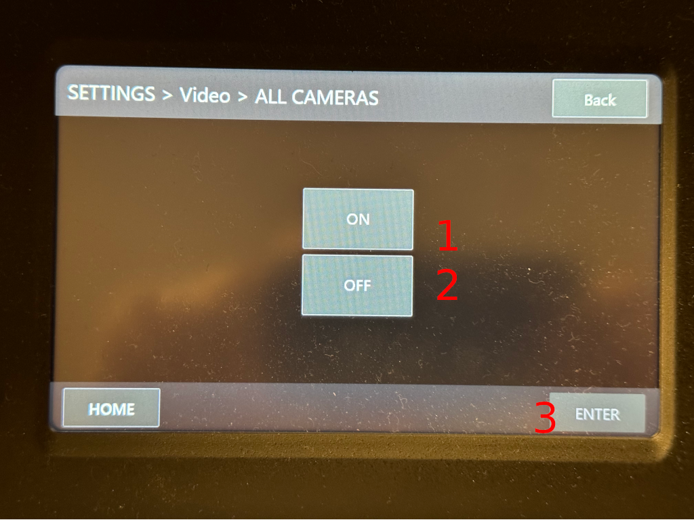
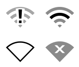

# Sunday Morning Checklist

Welcome to the Live Stream checklist. This is a living document and will change
as we improve services. Please note that the prioty of the stream is to keep
recording.  If we lose the internet connection, or experience network issues,
never stop OBS from recording. We can use the recording to upload a full
service during the week.

## Pre-Practice

### Hardware Setup

- [ ] Reboot Computer
- [ ] Turn on powerstrip with lights
- [ ] Turn on the PTZ controller with the switch on the back right corner.
  - [ ] Wake up the cameras:
    1. Go to settings

        

    1. Select Camera -> Video

        

    1. Select All Cameras

        

    1. (1) Select On and press (3) Enter

        

### Software Setup

- [ ] Log into streaming computer
- [ ] Ensure WiFi is disabled. This is the ice cream shaped icon on the top bar
  near the clock. (Solid outline means off, made of stripes means on)

    

- [ ] Start OBS
  - [ ] Start streaming
     > **IMPORTANT**: Do not start the streams in the Restream.io widget yet!

#### Use Restream in OBS

- [ ] Update title and discription [^1]
      The keyboard shortcuts for copy and paste will not work. You can right-click on a field in OBS
      and select paste.

During practice is a good time to make some notes on parts of worship that
might be good for getting certain shots. I find using the slide numbers
on pro-presenter and writing shot ideas down can make it easier during worship
live.

[^1]: There should be an email in Apple Mail with the week's title and
    description. If it is not there, please find Clint or whoever is preaching
that week.

## Pre-Service

- [ ] Between practice and pre-service is a good time to add any special videos
  or media to the OBS scenes if applicable

Starting 5 minutes before 10am, we start pre-service.

- [ ] Start recording in OBS (this is a good time to also remind and assist the
  sound engineer to start recording)
- [ ] Make the pre-service video live in OBS
- [ ] Start streaming to all locations in the OBS Restream panel (Facebook & YouTube)
   > **IMPORTANT**: The toggle can take a moment. Do not press it again. Wait 15+ seconds before
   > retrying if an error occurs

## Service

- [ ] Setup tracking after announcements as the speaker get ready to start the
      message.

   > **IMPORTANT**: Pay attention. Things happen quickly, and the best way to be ready is to keep
   > focused and have good safety shots. Use tracking, but pay attention to it.  If we are losing
   > tracking, go to a safety shot on the other cameras.

Be awesome and do a great job!

## Post Service

- [ ] Start the post service video in OBS as the service closes.  This needs to
  be done ASAP so we do not broadcast copywrited music.
- [ ] Stop recording on the video cameras
- [ ] While the end service video plays, go to both mixers and remove the flash
  drives (make sure the sound person stopped recording).
  - [ ] Attach the USBs to the streaming PC, and copy the audio recording from
    it to `LIVESTREAM` folder.
- [ ] When the post service video is over, stop streams
  - [ ] Stop Facebook Private group stream
  - [ ] Stop Restream.io
  - [ ] Stop streaming in OBS
- [ ] Stop OBS recording
- [ ] Power off Canon Cameras through the controller

  1. Go to settings

      

  1. Select Camera -> Video

      

  1. Select All Cameras

      

  1. (2) Select On and press (3) Enter

      

- [ ] Power off PTZ controller
